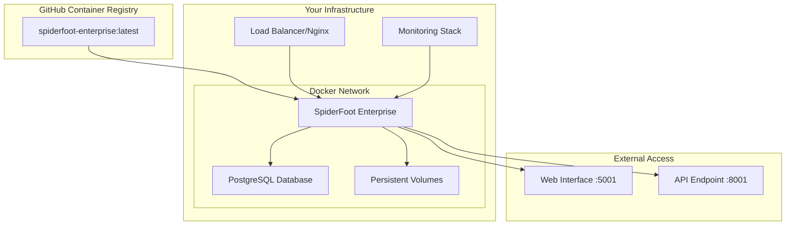

# SpiderFoot Enterprise Deployment Guide

## Overview

This guide covers the complete deployment process for your custom SpiderFoot enterprise image with private registry hosting and access control.

## 🎯 What You Have

✅ **Custom SpiderFoot Enterprise Image** - Built with latest features and security fixes
✅ **Private Registry Setup** - GitHub Container Registry with access control
✅ **Production-Ready Configuration** - PostgreSQL, security, monitoring
✅ **Automated Deployment** - Scripts for easy setup and management

## 📋 Prerequisites

### Required Software
- Docker Engine 20.10+
- Docker Compose 2.0+
- Git 2.30+
- Bash shell

### GitHub Requirements
- GitHub account
- Personal Access Token with `packages:write` permissions
- Private repository visibility (recommended)

### System Requirements
- **CPU**: 2+ cores
- **RAM**: 4GB minimum, 8GB recommended
- **Storage**: 50GB+ available space
- **Network**: Internet access for image pulls

## 🚀 Quick Start Deployment

### Step 1: Push to Private Registry

Run the automated registry setup:

```bash
# Make script executable
chmod +x deploy-enterprise-registry.sh

# Run the setup (you'll be prompted for GitHub credentials)
./deploy-enterprise-registry.sh
```

This script will:
- Authenticate with GitHub Container Registry
- Tag your image with version and latest
- Push to private registry
- Generate deployment configurations
- Create deployment scripts

### Step 2: Configure Environment

```bash
# Copy the environment template
cp .env.enterprise.template .env

# Edit with your settings
nano .env
```

Required configurations:
```env
# Database Security
POSTGRES_PASSWORD=your_secure_database_password_here

# SpiderFoot API Security
SF_API_KEY=your_api_key_here
SF_SECRET_KEY=your_secret_key_here

# Registry Access
GITHUB_USERNAME=your_github_username
GITHUB_TOKEN=your_github_token
```

### Step 3: Deploy Enterprise Stack

```bash
# Run the deployment
./deploy-enterprise.sh
```

## 🔧 Deployment Architecture



## 📁 Generated Files

The deployment process creates several key files:

### `docker-compose-enterprise-private.yml`
Production-ready compose file with:
- Private registry image reference
- PostgreSQL database with health checks
- Persistent volume configuration
- Network isolation
- Environment variable integration

### `.env.enterprise.template`
Environment configuration template with:
- Database credentials
- Security tokens
- Registry authentication
- Optional customizations

### `deploy-enterprise.sh`
Automated deployment script that:
- Validates configuration
- Authenticates with registry
- Creates required directories
- Sets proper permissions
- Deploys services with health checks

## 🔒 Security Configuration

### Registry Security
- **Private repository** - Only accessible to authorized users
- **Token authentication** - Time-limited access tokens
- **Team access control** - Granular permissions
- **Audit logging** - Track access and pulls

### Application Security
- **Non-root containers** - spiderfoot user (UID 1000)
- **Secret management** - Environment variables
- **Database isolation** - Dedicated network
- **Input validation** - Enhanced CSRF protection
- **Secure headers** - Production security settings

### Network Security
- **Private networks** - Docker internal networking
- **Port isolation** - Only necessary ports exposed
- **TLS ready** - Can be fronted with nginx/SSL
- **Firewall friendly** - Standard ports (5001, 8001)

## 🔧 Advanced Configuration

### Production Scaling

For production environments, you can extend the configuration:

```yaml
# Add to docker-compose-enterprise-private.yml
services:
  spiderfoot:
    deploy:
      replicas: 3
      resources:
        limits:
          cpus: '2.0'
          memory: 4G
        reservations:
          cpus: '1.0'
          memory: 2G
      restart_policy:
        condition: on-failure
        delay: 5s
        max_attempts: 3
```

### Load Balancer Integration

Add nginx for SSL termination and load balancing:

```yaml
  nginx:
    image: nginx:alpine
    ports:
      - "443:443"
      - "80:80"
    volumes:
      - ./nginx.conf:/etc/nginx/nginx.conf
      - ./ssl:/etc/nginx/ssl
    depends_on:
      - spiderfoot
```

### Monitoring Integration

Add monitoring stack:

```yaml
  prometheus:
    image: prom/prometheus
    ports:
      - "9090:9090"
    volumes:
      - ./prometheus.yml:/etc/prometheus/prometheus.yml

  grafana:
    image: grafana/grafana
    ports:
      - "3000:3000"
    environment:
      - GF_SECURITY_ADMIN_PASSWORD=admin
```

## 📊 Monitoring and Maintenance

### Health Checks

Monitor service health:
```bash
# Check all services
docker-compose -f docker-compose-enterprise-private.yml ps

# View logs
docker-compose -f docker-compose-enterprise-private.yml logs -f spiderfoot

# Check database connectivity
docker-compose -f docker-compose-enterprise-private.yml exec postgres pg_isready
```

### Image Updates

Update to newer versions:
```bash
# Build new version
docker build -t spiderfoot-enterprise:v2.0.0 .

# Push to registry
docker tag spiderfoot-enterprise:v2.0.0 ghcr.io/USERNAME/spiderfoot-enterprise:v2.0.0
docker push ghcr.io/USERNAME/spiderfoot-enterprise:v2.0.0

# Update compose file image reference
# Deploy with rolling update
docker-compose -f docker-compose-enterprise-private.yml up -d
```

### Backup Strategy

**Database Backups:**
```bash
# Automated backup script
docker-compose -f docker-compose-enterprise-private.yml exec postgres pg_dump -U spiderfoot spiderfoot_enterprise > backup_$(date +%Y%m%d_%H%M%S).sql
```

**Volume Backups:**
```bash
# Backup persistent data
docker run --rm -v spiderfoot_spiderfoot-data:/data -v $(pwd):/backup alpine tar czf /backup/spiderfoot-data-$(date +%Y%m%d).tar.gz -C /data .
```

## 🛠️ Troubleshooting

### Common Issues

**Authentication Failures:**
```bash
# Re-authenticate with GitHub
echo $GITHUB_TOKEN | docker login ghcr.io -u $GITHUB_USERNAME --password-stdin
```

**Permission Issues:**
```bash
# Fix file permissions
sudo chown -R 1000:1000 data/spiderfoot logs/spiderfoot cache/spiderfoot
```

**Database Connection Issues:**
```bash
# Check PostgreSQL logs
docker-compose logs postgres

# Test database connectivity
docker-compose exec spiderfoot python -c "
import psycopg2
conn = psycopg2.connect(host='postgres', database='spiderfoot_enterprise', user='spiderfoot', password='$POSTGRES_PASSWORD')
print('Database connection successful')
"
```

### Performance Tuning

**PostgreSQL Optimization:**
```yaml
# Add to postgres service environment
environment:
  - POSTGRES_SHARED_BUFFERS=256MB
  - POSTGRES_EFFECTIVE_CACHE_SIZE=1GB
  - POSTGRES_WORK_MEM=4MB
  - POSTGRES_MAINTENANCE_WORK_MEM=64MB
```

**SpiderFoot Optimization:**
```yaml
# Add to spiderfoot service environment
environment:
  - SF_MAX_THREADS=20
  - SF_CACHE_SIZE=512MB
  - SF_BULK_SIZE=1000
```

## 📞 Support and Resources

### Access Control Management

**GitHub Package Settings:**
1. Go to `https://github.com/USERNAME?tab=packages`
2. Click on `spiderfoot-enterprise` package
3. Settings > Change visibility > Private
4. Manage Actions access > Add team members

**Token Management:**
- Rotate tokens every 90 days
- Use separate tokens for CI/CD vs manual access
- Monitor token usage in GitHub security logs

### Registry Management

**Storage Optimization:**
- Delete old image versions regularly
- Use lifecycle policies for automated cleanup
- Monitor storage usage in GitHub settings

**Security Monitoring:**
- Enable vulnerability scanning
- Review access logs regularly
- Monitor for unauthorized access attempts

## ✅ Deployment Checklist

### Pre-Deployment
- [ ] GitHub Personal Access Token created with packages:write
- [ ] Repository set to private
- [ ] Docker and Docker Compose installed
- [ ] System requirements met
- [ ] Firewall rules configured

### Registry Setup
- [ ] Custom image built successfully
- [ ] Registry authentication working
- [ ] Images pushed to private registry
- [ ] Access control configured
- [ ] Team members added (if applicable)

### Application Deployment
- [ ] Environment file configured
- [ ] Database password set
- [ ] API keys generated
- [ ] Deployment script executed
- [ ] Services health checks passing

### Post-Deployment
- [ ] Web interface accessible
- [ ] API endpoints responding
- [ ] Database connectivity verified
- [ ] Logs showing normal operation
- [ ] Backup strategy implemented
- [ ] Monitoring configured
- [ ] Documentation updated

## 🎉 Success!

Your SpiderFoot Enterprise is now deployed with:

✅ **Private Container Registry** - Full ownership and access control
✅ **Production Security** - Enhanced authentication and validation
✅ **Scalable Architecture** - PostgreSQL backend with monitoring
✅ **Automated Deployment** - Repeatable and maintainable
✅ **Enterprise Features** - AI threat intelligence, advanced storage, security hardening

**Access your deployment at:**
- Web Interface: `http://your-server:5001`
- API Endpoint: `http://your-server:8001`

For production use, configure SSL termination and domain routing through your load balancer or reverse proxy.

---
*Generated for SpiderFoot Enterprise Deployment*
*Last updated: $(date)*