# SpiderFoot As-Is System Architecture Design

**Version:** 1.0
**Date:** 2025-11-02
**Status:** Documentation of Current System

---

## Table of Contents

1. [Overview](#overview)
2. [System Context](#system-context)
3. [High-Level Architecture](#high-level-architecture)
4. [Component Architecture](#component-architecture)
5. [Data Architecture](#data-architecture)
6. [Module System Architecture](#module-system-architecture)
7. [Event Processing Architecture](#event-processing-architecture)
8. [Correlation Engine Architecture](#correlation-engine-architecture)
9. [API Architecture](#api-architecture)
10. [Deployment Architecture](#deployment-architecture)
11. [Security Architecture](#security-architecture)

---

## Overview

SpiderFoot is an OSINT (Open Source Intelligence) automation platform that collects, correlates, and analyzes data from 277+ data sources. The system uses an event-driven, plugin-based architecture where modules consume and produce events in recursive chains, with parallel correlation analysis.

### Key Characteristics

- **Architecture Pattern:** Event-Driven, Plugin-Based
- **Language:** Python 3.11+
- **Web Framework:** CherryPy (Web UI) + FastAPI (REST API)
- **Database:** SQLite (default) / PostgreSQL (enterprise)
- **Modules:** 277 OSINT collection plugins
- **Correlation Rules:** 56+ YAML-based rules
- **Event Types:** 389 classified data types

---

## System Context

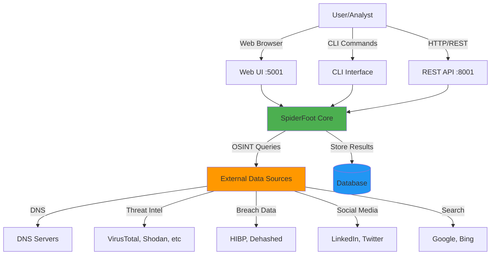

---

## High-Level Architecture

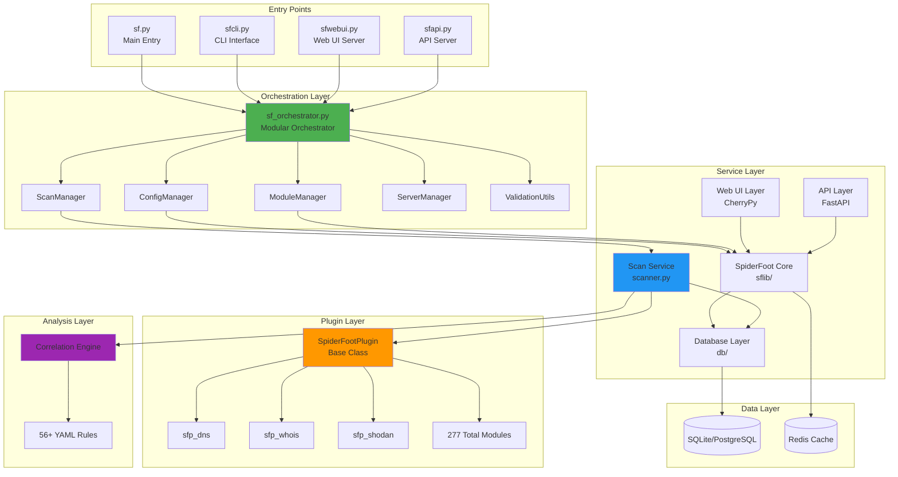

---

## Component Architecture

### Core Components Detail

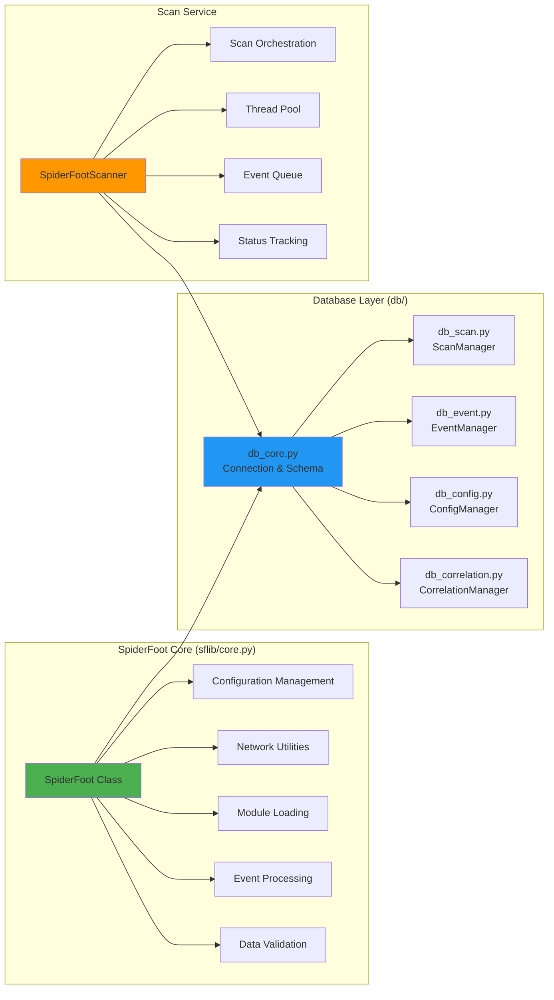

---

## Data Architecture

### Database Schema

```mermaid
erDiagram
    tbl_event_types ||--o{ tbl_scan_results : "defines"
    tbl_scan_instance ||--o{ tbl_scan_results : "contains"
    tbl_scan_instance ||--o{ tbl_scan_log : "tracks"
    tbl_scan_instance ||--o{ tbl_scan_config : "configures"
    tbl_scan_instance ||--o{ tbl_scan_correlation_results : "produces"
    tbl_scan_correlation_results ||--o{ tbl_scan_correlation_results_events : "maps"
    tbl_scan_results ||--o{ tbl_scan_correlation_results_events : "linked_to"

    tbl_event_types {
        string event string PK
        string event_descr
        string event_raw
        string event_type
    }

    tbl_scan_instance {
        string guid PK
        string name
        string scanTarget
        string targetType
        string scanStatus
        timestamp created
        timestamp started
        timestamp ended
    }

    tbl_scan_results {
        string scan_instance_id FK
        string hash PK
        string type FK
        datetime generated
        int confidence
        int visibility
        int risk
        string module
        string data
        string source_event_hash
    }

    tbl_scan_log {
        string scan_instance_id FK
        timestamp generated
        string component
        string type
        string message
    }

    tbl_scan_config {
        string scan_instance_id FK
        string component
        string opt
        string val
    }

    tbl_config {
        string scope
        string opt
        string val
    }

    tbl_scan_correlation_results {
        string scan_instance_id FK
        string rule_id
        timestamp created
        string title
        string risk
        string description
        text data
    }

    tbl_scan_correlation_results_events {
        string correlation_result_id FK
        string scan_result_id FK
    }
```

### Data Flow Architecture

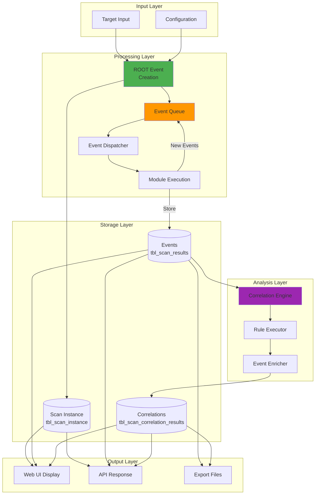

---

## Module System Architecture

### Plugin Architecture

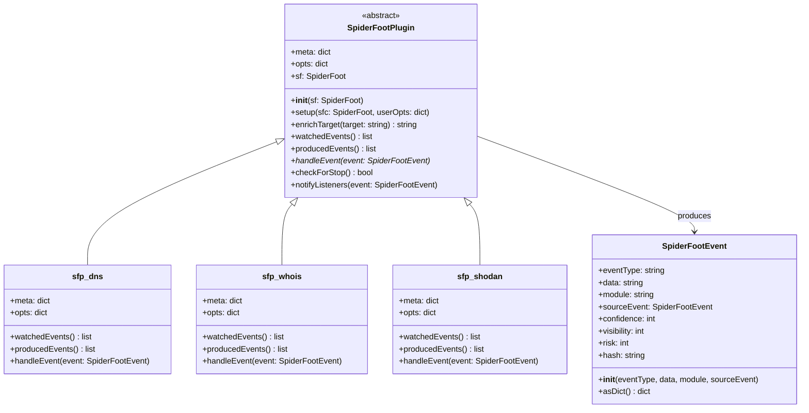

### Event Chain Flow

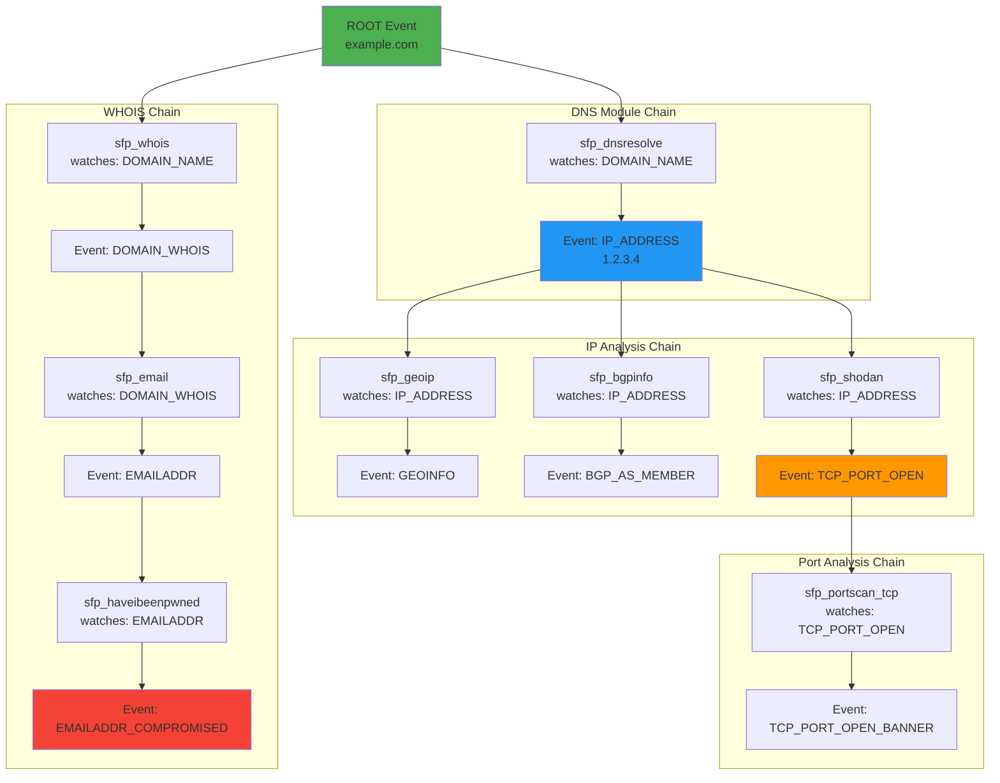

---

## Event Processing Architecture

### Scan Execution Flow

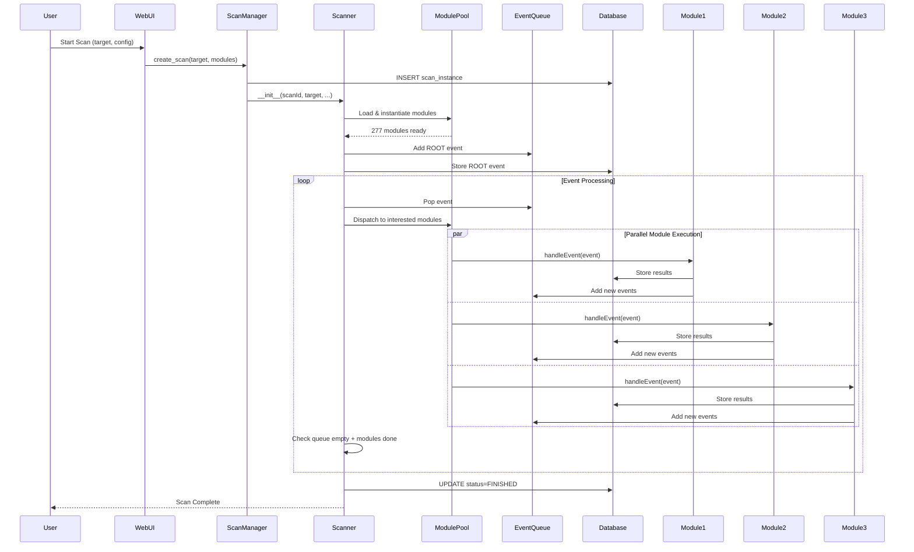

### Thread Pool Management

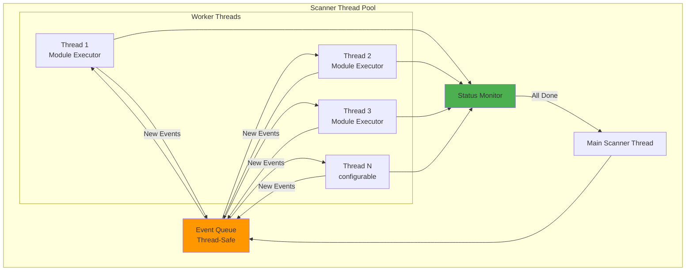

---

## Correlation Engine Architecture

### Correlation Processing

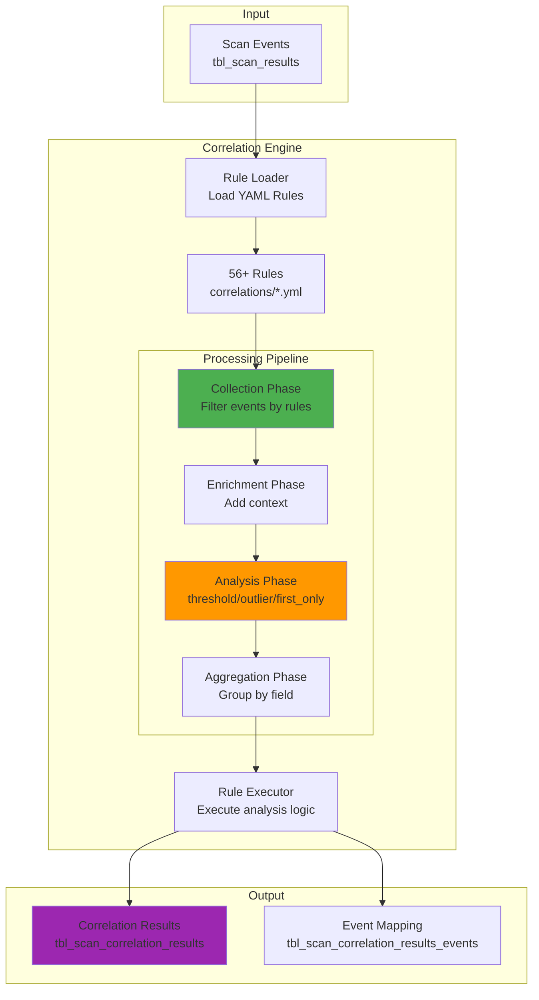

### Correlation Rule Structure

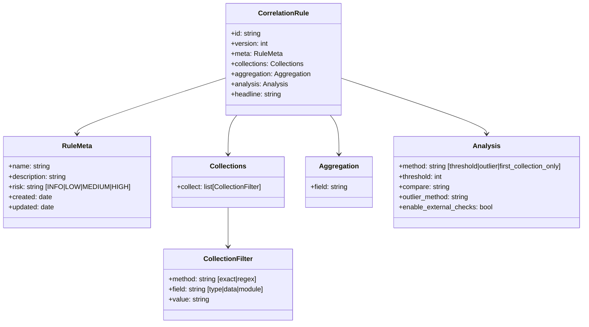

---

## API Architecture

### REST API Structure

```mermaid
graph TB
    subgraph "API Entry Point"
        FASTAPI[FastAPI Application<br/>:8001]
    end

    subgraph "API Routes"
        SCAN_ROUTES[/api/scan/*<br/>Scan Management]
        RESULT_ROUTES[/api/results/*<br/>Result Retrieval]
        MODULE_ROUTES[/api/modules<br/>Module Info]
        CONFIG_ROUTES[/api/config<br/>Configuration]
        WORKSPACE_ROUTES[/api/workspaces/*<br/>Workspace Mgmt]
    end

    subgraph "WebSocket"
        WS[/ws/scan/:id<br/>Real-time Events]
    end

    subgraph "Service Layer"
        SCAN_SVC[Scan Service]
        DB_SVC[Database Service]
        CONFIG_SVC[Config Service]
    end

    subgraph "Documentation"
        SWAGGER[/api/docs<br/>Swagger UI]
        REDOC[/api/redoc<br/>ReDoc]
    end

    FASTAPI --> SCAN_ROUTES
    FASTAPI --> RESULT_ROUTES
    FASTAPI --> MODULE_ROUTES
    FASTAPI --> CONFIG_ROUTES
    FASTAPI --> WORKSPACE_ROUTES
    FASTAPI --> WS

    SCAN_ROUTES --> SCAN_SVC
    RESULT_ROUTES --> DB_SVC
    MODULE_ROUTES --> CONFIG_SVC
    CONFIG_ROUTES --> CONFIG_SVC
    WORKSPACE_ROUTES --> DB_SVC

    FASTAPI --> SWAGGER
    FASTAPI --> REDOC

    style FASTAPI fill:#4CAF50
    style WS fill:#FF9800
```

### API Request Flow

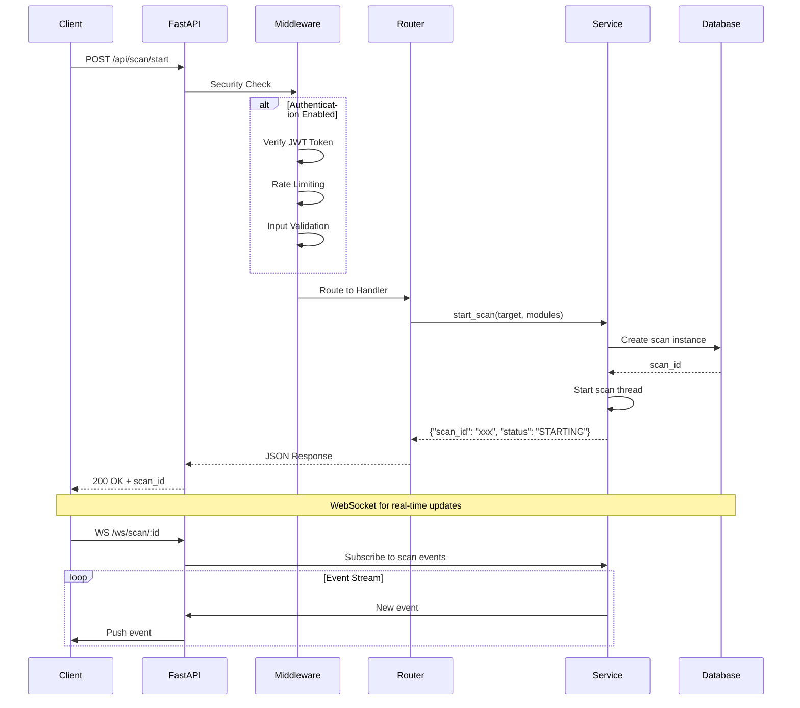

---

## Deployment Architecture

### Docker Architecture

```mermaid
graph TB
    subgraph "Docker Container"
        subgraph "Application Layer"
            WEBUI_PROC[Web UI Process<br/>CherryPy :5001]
            API_PROC[API Process<br/>FastAPI :8001]
        end

        subgraph "Service Layer"
            SF_CORE[SpiderFoot Core]
            MODULES[277 Modules]
        end

        subgraph "External Tools"
            NUCLEI[Nuclei]
            DNSTWIST[DNStwist]
            TESTSSL[testssl.sh]
            NMAP[Nmap]
            WHATWEB[WhatWeb]
        end

        subgraph "Volumes"
            DATA[/home/spiderfoot/data<br/>Database]
            LOGS[/home/spiderfoot/logs<br/>Logs]
            CACHE[/home/spiderfoot/cache<br/>Module Cache]
        end
    end

    subgraph "External Services"
        POSTGRES[(PostgreSQL<br/>Optional)]
        REDIS[(Redis<br/>Optional)]
    end

    subgraph "Reverse Proxy"
        NGINX[Nginx]
    end

    USER[Users] --> NGINX
    NGINX --> WEBUI_PROC
    NGINX --> API_PROC

    WEBUI_PROC --> SF_CORE
    API_PROC --> SF_CORE

    SF_CORE --> MODULES
    MODULES --> NUCLEI
    MODULES --> DNSTWIST
    MODULES --> TESTSSL
    MODULES --> NMAP
    MODULES --> WHATWEB

    SF_CORE --> DATA
    SF_CORE --> LOGS
    SF_CORE --> CACHE

    SF_CORE -.->|Optional| POSTGRES
    SF_CORE -.->|Optional| REDIS

    style SF_CORE fill:#4CAF50
    style DATA fill:#2196F3
    style POSTGRES fill:#2196F3
```

### Multi-Process Architecture

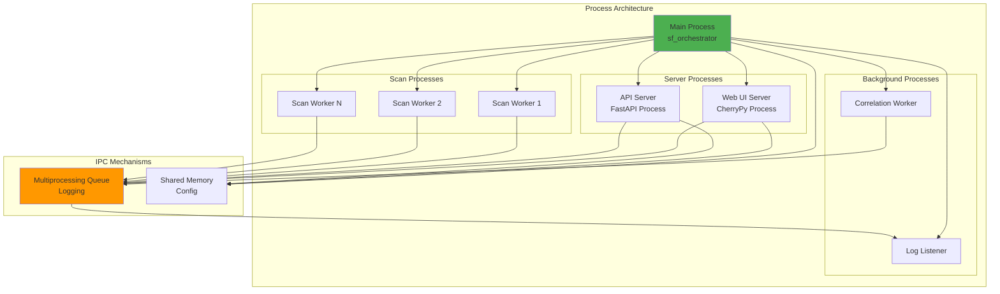

---

## Security Architecture

### Security Layers

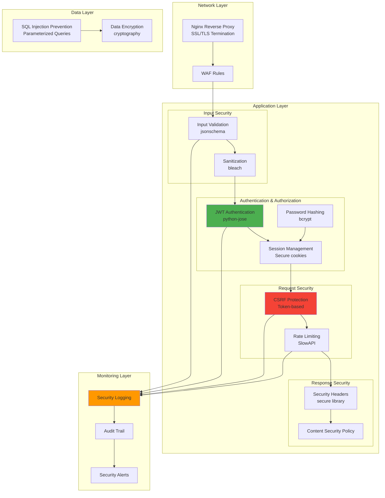

### Security Configuration Flow

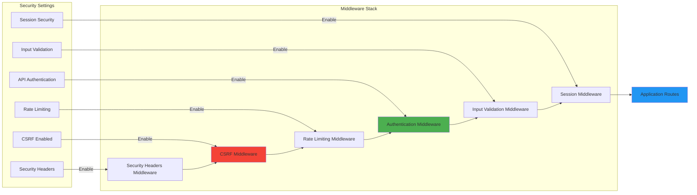

---

## Technology Stack Summary

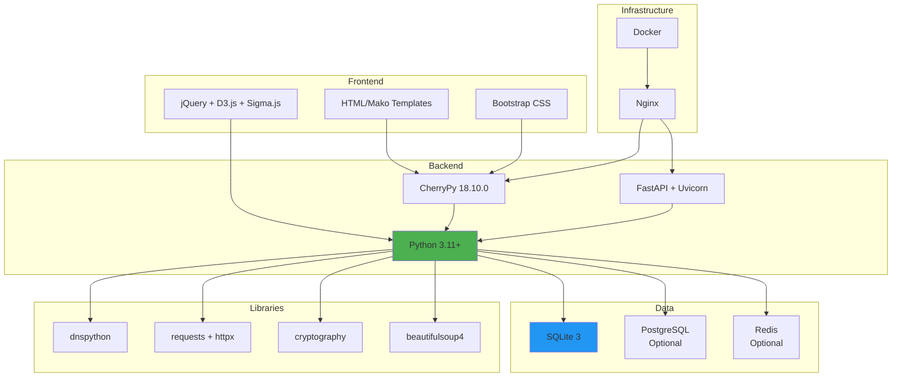

---

## Design Patterns

### Pattern Usage

1. **Plugin/Strategy Pattern**: Module system with pluggable OSINT collectors
2. **Observer Pattern**: Event-driven architecture with event listeners
3. **Factory Pattern**: Module instantiation and configuration
4. **Chain of Responsibility**: Event chain processing through modules
5. **Facade Pattern**: SpiderFoot core class as unified interface
6. **Repository Pattern**: Database layer abstraction (SQLite/PostgreSQL)
7. **Command Pattern**: CLI command processing
8. **Singleton Pattern**: Configuration management
9. **Producer-Consumer Pattern**: Event queue processing
10. **Template Method Pattern**: SpiderFootPlugin base class

---

## Performance Characteristics

- **Concurrency**: Configurable thread pool (default: 3 threads)
- **Scalability**: Horizontal via multiple scan workers
- **Caching**: Redis support for API responses
- **Database**: PostgreSQL for large deployments
- **Async**: FastAPI async endpoints for API layer
- **Queue**: Thread-safe event queue with backpressure

---

## Conclusion

The SpiderFoot architecture is designed as a modular, event-driven OSINT automation platform. Key strengths include:

- **Modularity**: 277 pluggable modules
- **Extensibility**: Easy to add new modules and correlation rules
- **Flexibility**: Multiple interfaces (Web UI, CLI, API)
- **Scalability**: Multi-process, multi-threaded architecture
- **Security**: Comprehensive security layers
- **Analysis**: Automated correlation and pattern detection

The system follows clean separation of concerns with orchestration, service, plugin, and data layers clearly defined.
